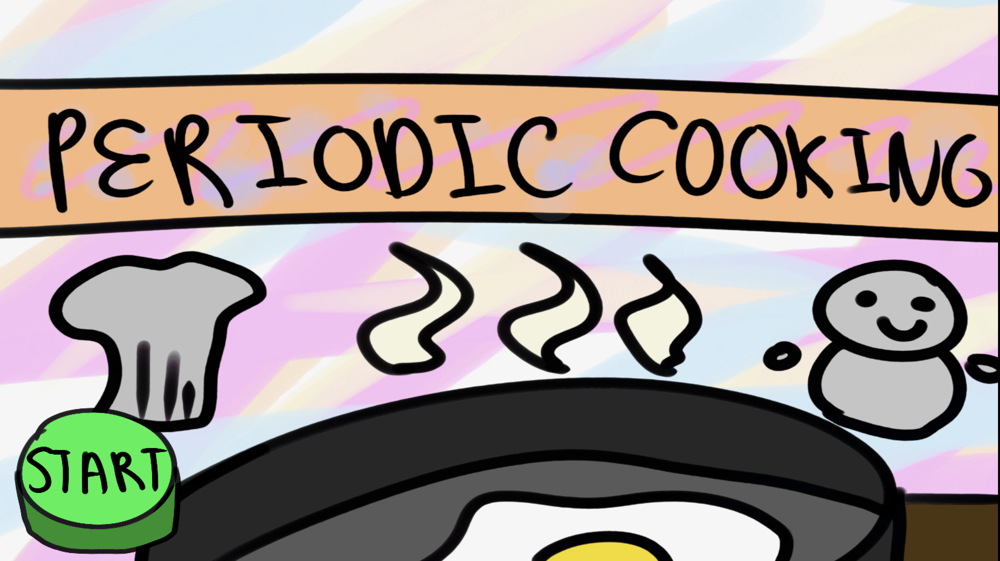
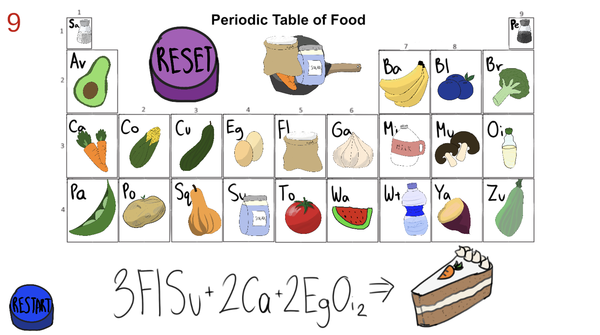
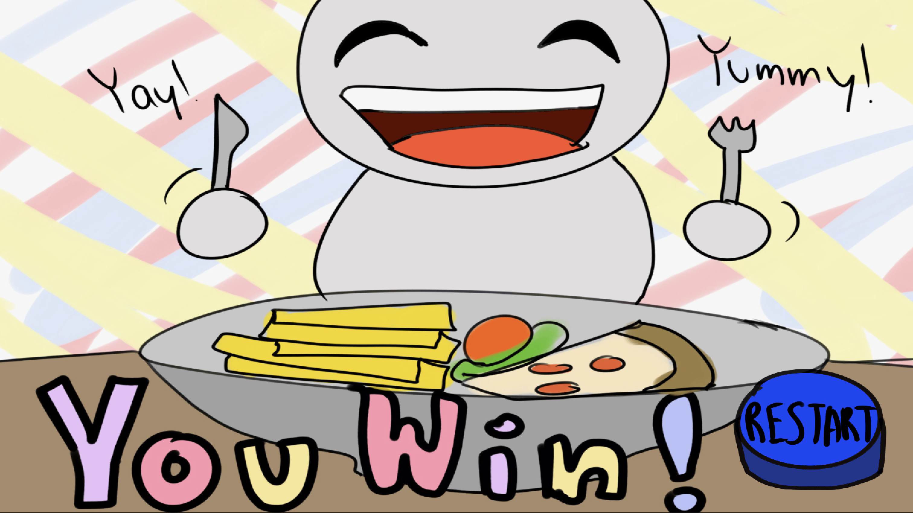
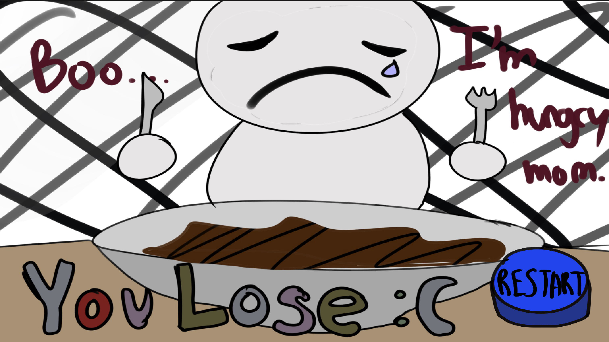
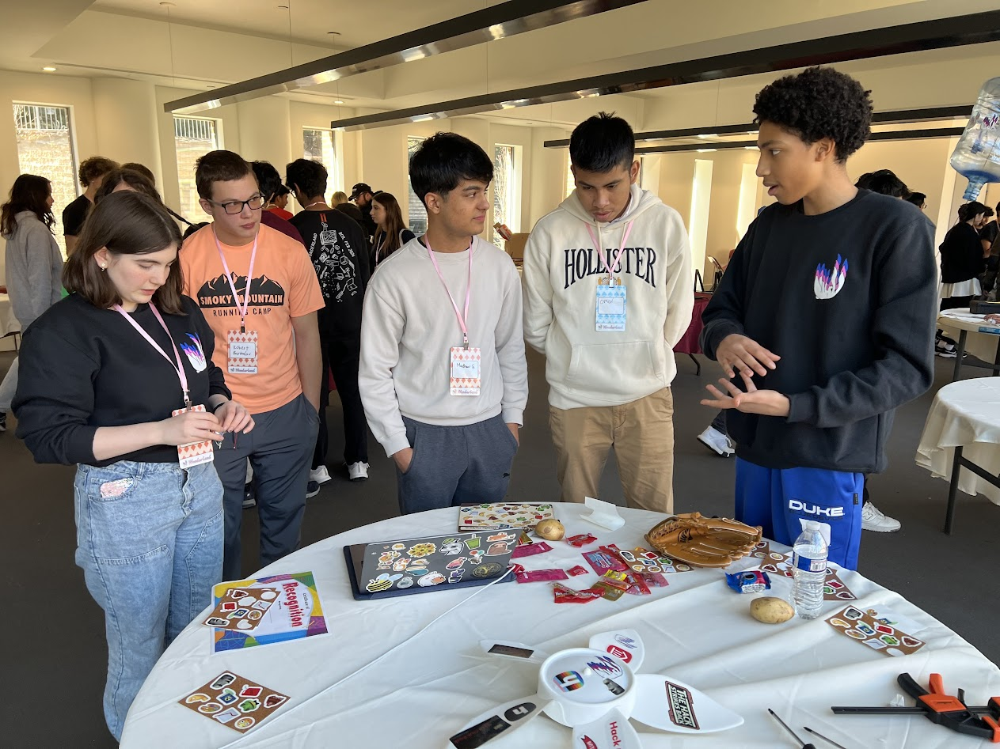
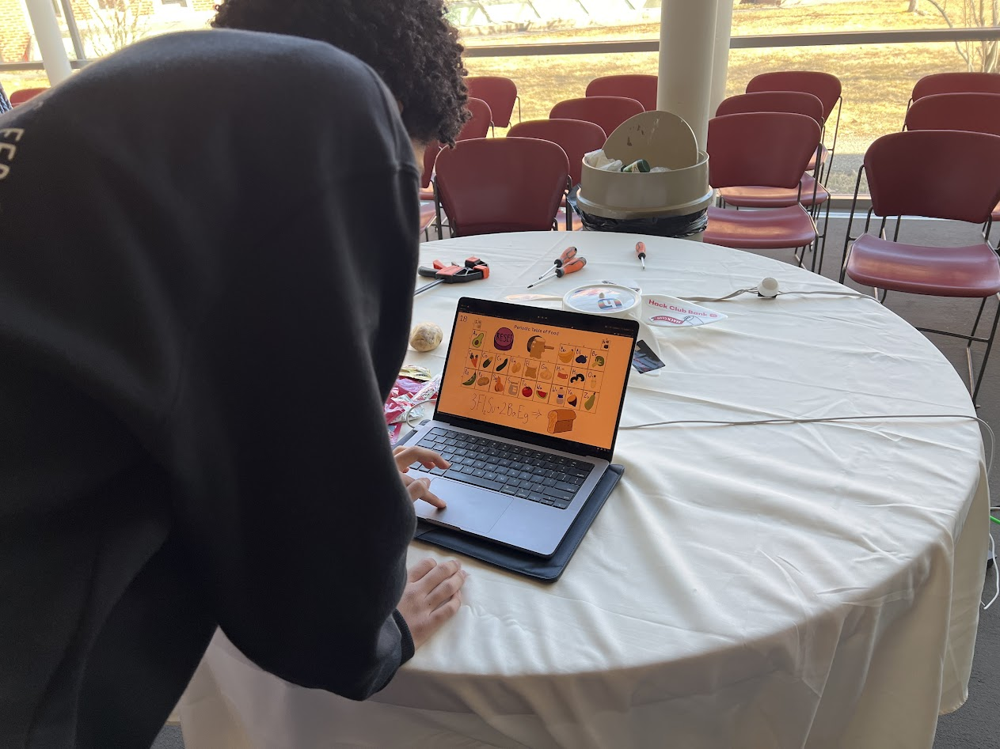
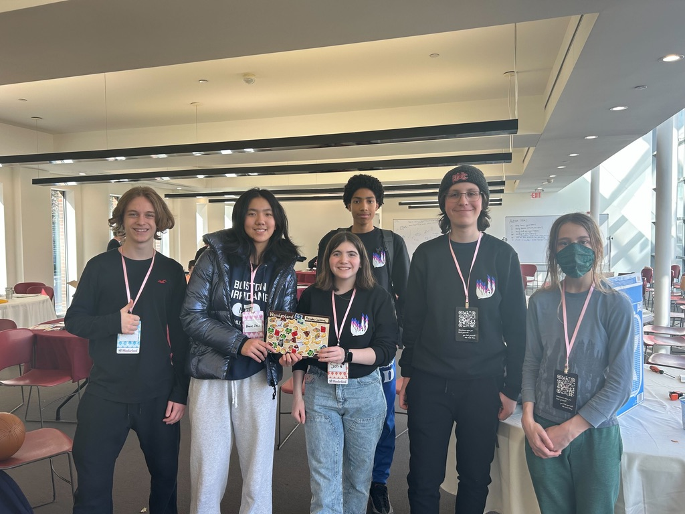

# Chest Ten

### Started With:
- Waffle Maker
- 3 x Periodic Table of Elements
- Baseball Glove
- 2 x Potatoes
- 2 x Tomatoes
- Hockey Puck
- Calculator

### Team Members:
- @EerierGosling
- @anniezhu08
- @evan-gan
- @LimesKey
- @Cosmin-Mare
- @Ironbeast10
- @Sir-Hi

### Trade Record:
- Tomato -> Computer Lock
- Periodic Table -> Computer Lock
- "A nice conversation" -> DJ Childrens Toy
- Heated Waffle Iron -> Clorox Disinfecting Wipes
- Asking nicely -> A box fan

## End Result

### Ended With

### Project Summary
We ended up making a Unity-based science & cooking game to help others know how to combine made-up elements and strengthen their reading and computer skills. 

This is far from what we started with, we initally had the idea of creating a hot-potato launcher system using the waffle iron, a spring, and a motor in which a person would catch the hot potato with a baseball glove after loosing the game.

We struggled with our inital idea due to time and hardware-resource contrsaints, but we generally agreed that it would be a good idea if there were no roadblocks.

### How did the items in your box inspire you?
I think our box was quite well put together and after only 5 minutes of recieving the box, we start brainstorming ideas of what to make with the items. People like french fries, and we had potatoes and a skillet, so we first came up with french-fry-centered ideas.

### What items did you use?
We mainly used the periodic tables, the potatos, the tomato, a fan motor, and the Clorox disinfecting wipes. It wasn't as many of the items as we hoped to use but we had fun with it.