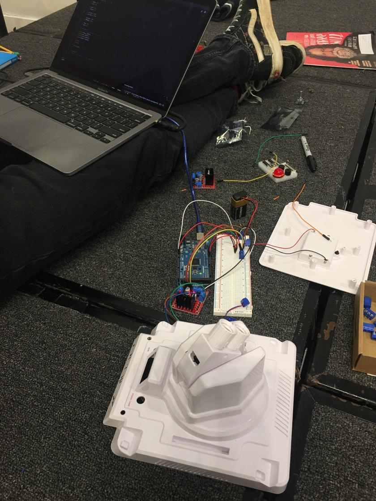

# Chest Twelve

### Started With:
 
- ProjeX Arcade Game
- Magazine
- Bug Spray
- Roller Stamp
- Tomato

### Team Members:

- Aiden Delcore
- Avishn Sharma
- Anne Li [thisthatwhenwhere](https://github.com/thisthatwhenwhere)
- Shav Kinderlehrer [secondary-smiles](https://github.com/secondary-smiles)
- Steven Chen 

### Trade Record:

## End Result

### Ended With:

We ended up with a demo of a turret that could fairly accurately track and rotate to follow people as they moved around it's field of view.

The turret works well on the X-Axis, and more inconsistently when tracking objects vertically on the Y-Axis.

### Project Summary

A device that is able to position itself to track objects (like faces) using a laptop webcam.

### How did the items in your box inspire you?

The ProjeX Game had a very neat dual-motor control system that we were inspired to adapt to our project. The tomato served as a very useful target for debugging the visual system. The bug spray was subject to a lot of debate, but it gave us the idea to use the motors to track objects.

### What items did you use?

- ProjeX Arcade Game
- Tomato
- Bug Spray

